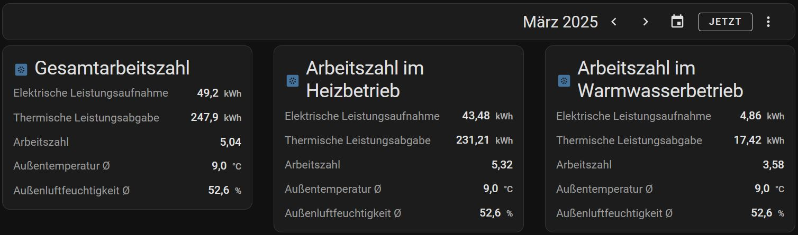

# Home Assistant Heatpump Performance Card

A custom Home Assistant card that displays heat pump performance by reading two sensor entities (electrical and thermal energy) and calculating the coefficient of performance (COP).
The card listens for date range selections provided by an energy-date-selection card and fetches historical data from Home Assistant's Data Recoder or Statistics. Additionally, it can display time-weighted average values for outdoor temperature and humidity over the selected time period.



## Basic Setup

Ensure that an `energy-date-selection` card is added to your page.
You can add it as a manual card via the "Add Card" menu with the following content:
```
type: energy-date-selection
```
You can then add one or more custom heatpump-performance-card cards to your dashboard. 

Here’s a full example YAML configuration for the card:
```
type: custom:heatpump-performance-card
name: Heatpump Performance
cop_name: Performance (COP) # Optional: Configure the label for the COP row (defaults to "COP")
entities:
  - entity: sensor.electrical_energy
    name: Electrical Energy
  - entity: sensor.thermal_energy
    name: Thermal Energy
outdoor_temperature: # Optional: Display outdoor temperature average
  entity: sensor.outdoor_temperature
  name: Outdoor Temperature
outdoor_humidity: # Optional: Display outdoor humidity average
  entity: sensor.outdoor_humidity
  name: Outdoor Humidity
```

In this example, the card will display the two sensor values, calculate the Performance (COP) based on the retrieved data, and show time-weighted average values for outdoor temperature and humidity over the selected period.

## Installation

#### HACS
1. Navigate to the HACS tab in your Home Assistant and open the Frontend section.
2. Click the three-dot menu in the top right corner.
3. Select Custom repositories.
4. Enter `andiwirs/ha-heatpump-performance-card` as the repository and select `Dashboard` as the category.
5. Click Add and then install the `heatpump-performance-card` from HACS.
6. Refresh your browser.

See the [HACS Custom Repository](https://hacs.xyz/docs/faq/custom_repositories/) page for full details.

#### Manual
1. Copy the `heatpump-performance-card.js` file into your Home Assistant's `/www` folder.
2. In Home Assistant, go to your Dashboard, click on Edit Dashboard, then Manage Resources.
3. Add `/local/heatpump-performance-card.js` as a JavaScript Module.
4. Save and refresh your Home Assistant dashboard.